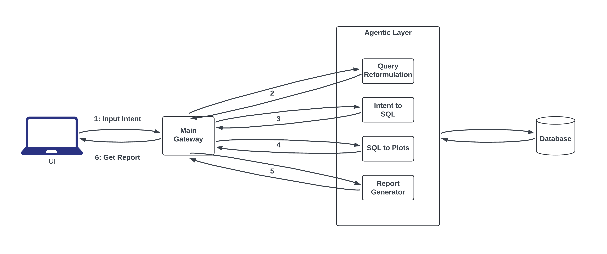

# **KHWARIZMI**

## **Project Architecture**


---

## **Overview**
KHWARIZMI: From Thought to Vision. Our system transforms your natural language prompts into comprehensive reports with data visualizations, SQL queries, and textual explanations - turning your analytical thoughts into visual insights.

---

## **Agents**
1. **Reformulate Intent Agent** - Refines user queries
2. **Intent to Query Agent** - Generates SQL from natural language
3. **Query to Plots Agent** - Creates visualizations from query results
4. **API to Report Agent** - Assembles the final HTML report

---

## **Tech Stack**
- FastAPI microservices
- PostgreSQL database
- Docker containers
- MinIO for chart storage
- LangChain and OpenAI

---

## **Setup**

### Prerequisites

- Docker and Docker Compose
- OpenAI API key
- Python 3.10+ (for local development)

### Environment

Create a `.env` file:
```
OPENAI_API_KEY=your_openai_api_key
POSTGRES_URI=postgresql://postgres:postgres@db:5432/northwind
```

### Running

With Docker:
```bash
docker-compose up -d
```

For development:
```bash
pip install -r requirements.txt
```
---

## Usage

Website: (Coming Soon)

API endpoint: `http://localhost:8074`

Example:
```bash
curl -X POST http://localhost:8074/pipeline \
  -H "Content-Type: application/json" \
  -d '{"intent": "Show me the top 10 best-selling products", "model": "gpt-4o-mini"}'
```
---

## **Example Queries**

- "Top 10 best-selling products by quantity sold"
- "Total sales by customer for top 10 customers"
- "Monthly sales trends from 1996 to 1998"
- "Employees with most orders and their sales volume"

---

## **Acknowledgments**

Built by Team KHWARIZMI during the Aalto AI Hackathon 2025. Special thanks to all team members and mentors for their contributions.